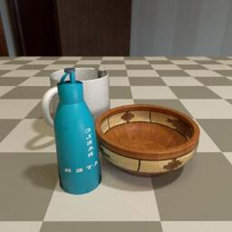
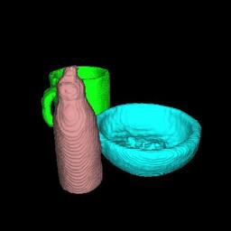
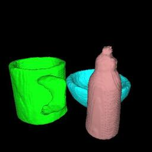

# CoReNet





CoReNet is a technique for joint multi-object 3D reconstruction from a single
RGB image. It produces coherent reconstructions, where all objects live in a
single consistent 3D coordinate frame relative to the camera, and they do not
intersect in 3D. You can find more information in the following paper:
[CoReNet: Coherent 3D scene reconstruction from a single RGB image](
https://arxiv.org/abs/2004.12989).

This repository contains source code, dataset pointers, and instructions for
reproducing the results in the paper. If you find our code, data, or the paper
useful, please consider citing

```
@InProceedings{popov20eccv,
  title="CoReNet: Coherent 3D Scene Reconstruction from a Single RGB Image",
  author="Popov, Stefan and Bauszat, Pablo and Ferrari, Vittorio", 
  booktitle="Computer Vision -- ECCV 2020",
  year="2020",
  doi="10.1007/978-3-030-58536-5_22"
}
```

#### Table of Contents 
* [Installation](#installation)
* [Datasets](#datasets)
* [Models from the paper](#models-from-the-paper)
* [Training and evaluating a new model](#training-and-evaluating-a-new-model)
* [Further details](#further-details)


## Installation

The code in this repository has been verified to work on Ubuntu 18.04 with the
following dependencies:

```bash
# General APT packages
sudo apt install \
  python3-pip python3-virtualenv python python3.8-dev g++-8 \
  ninja-build git libboost-container-dev unzip

# NVIDIA related packages
sudo apt-key adv --fetch-keys https://developer.download.nvidia.com/compute/cuda/repos/ubuntu1804/x86_64/7fa2af80.pub
sudo add-apt-repository "deb https://developer.download.nvidia.com/compute/cuda/repos/ubuntu1804/x86_64/ /"
sudo add-apt-repository "deb https://developer.download.nvidia.com/compute/machine-learning/repos/ubuntu1804/x86_64 /"
sudo apt install \
    nvidia-driver-455 nvidia-utils-455 `#driver, CUDA+GL libraries, utils` \
    cuda-runtime-10-1 cuda-toolkit-10-2 libcudnn7 `# Cuda and CUDNN`
```

To install CoReNet, you need to clone the code from GitHub and create a python
virtual environment. 
 
```bash
# Clone CoReNet
mkdir -p ~/prj/corenet
cd ~/prj/corenet
git clone https://github.com/google-research/corenet.git .

# Setup a python virtual environment
python3.8 -m virtualenv --python=/usr/bin/python3.8 venv_38
. venv_38/bin/activate
pip install -r requirements.txt
```

All instructions below assume that CoReNet lives in `~/prj/corenet`, that this
is the current working directory, and that the virtual environment is activated.
You can also run CoReNet using the supplied docker file:
`~/prj/corenet/Dockerfile`.

## Datasets

The CoReNet paper introduced several datasets with synthetic scenes. To
reproduce the experiments in the paper you need to download them, using: 
 
```bash
cd ~/prj/corenet
mkdir -p ~/prj/corenet/data/raw
for n in single pairs triplets; do  
  for s in train val test; do
    wget "https://storage.googleapis.com/gresearch/corenet/${n}.${s}.tar" \
      -O "data/raw/${n}.${s}.tar" 
    tar -xvf "data/raw/${n}.${s}.tar" -C data/ 
  done 
done
```

For each scene, these datasets provide the objects placement, a good view point,
and two images rendered from it with a varying degree of realism. To download
the actual object geometry, you need to download `ShapeNetCore.v2.zip` from
[ShapeNet](https://www.shapenet.org/)'s original site, unpack it, and convert
the 3D meshes to CoReNet's binary format:

```bash
echo "Please download ShapeNetCore.v2.zip from ShapeNet's original site and "
echo "place it in ~/prj/corenet/data/raw/ before running the commands below"

cd ~/prj/corenet
unzip data/raw/ShapeNetCore.v2.zip -d data/raw/
PYTHONPATH=src python -m preprocess_shapenet \
  --shapenet_root=data/raw/ShapeNetCore.v2 \
  --output_root=data/shapenet_meshes
```


## Models from the paper

To help reproduce the results from the CoReNet paper, we offer 5 pre-trained
models from it (`h5`, `h7`, `m7`, `m9`, and `y1`; details below and in 
the paper). You can download and unpack these using:

```bash
cd ~/prj/corenet
wget https://storage.googleapis.com/gresearch/corenet/paper_tf_models.tgz \
  -O data/raw/paper_tf_models.tgz
tar xzvf data/raw/paper_tf_models.tgz -C data/
```

You can evaluate the downloaded models against their respective test sets using: 
```bash
MODEL=h7  # Set to one of: h5, h7, m7, m9, y1

cd ~/prj/corenet
ulimit -n 4096
OMP_NUM_THREADS=2 CUDA_HOME=/usr/local/cuda-10.2 PYTHONPATH=src \
TF_CPP_MIN_LOG_LEVEL=1 PATH="${PATH}:${CUDA_HOME}/bin" \
FILL_VOXELS_CUDA_FLAGS=-ccbin=/usr/bin/gcc-8 \
python -m dist_launch --nproc_per_node=1 \
tf_model_eval --config_path=configs/paper_tf_models/${MODEL}.json5
```

To run on multiple GPUs in parallel, set `--nproc_per_node` to the number of
desired GPUs. You can use `CUDA_VISIBLE_DEVICES` to control which GPUs exactly
to use. `CUDA_HOME`, `PATH`, and `FILL_VOXELS_CUDA_FLAGS` control the
just-in-time compiler for the voxelization operation. 

Upon completion, quantitative results will be stored in 
`~/prj/corenet/output/paper_tf_models/${MODEL}/voxel_metrics.csv`.
Qualitative results will be available in 
`~/prj/corenet/output/paper_tf_models/${MODEL}/` in the form of
PNG files.

This table summarizes the model attributes and their performance.
More details can be found in the paper.

| model | dataset   | realism | native resolution | mean IoU |
| :---: | :---:     | :---:   | :---:             | :---:    |
| h5    | single    | low     | 128 x 128 x 128   | 57.9%    |
| h7    | single    | high    | 128 x 128 x 128   | 59.1%    |  
| y1    | single    | low     | 32  x 32  x 32    | 53.3%    |
| m7    | pairs     | high    | 128 x 128 x 128   | 43.1%    |  
| m9    | triplets  | high    | 128 x 128 x 128   | 43.9%    |  

Note that all models are evaluated on a grid resolution of `128 x 128 x 128`,
independent of their native resolution (see section 3.5 in the paper).
The performance computed with this code matches the one reported in the
paper for `h5`, `h7`, `m7`, and `m9`. For `y1`, the performance here is slightly
higher (+0.2% IoU), as we no longer have the exact checkpoint used in the paper.

You can also run these models on individual images interactively, using the
`corenet_demo.ipynb` notebook. For this, you need to also
`pip install jupyter-notebook` in your virtual environment.


## Training and evaluating a new model

We offer PyTorch code for training and evaluating models. To train a model, you
need to (once) import the starting ResNet50 checkpoint:
```bash
cd ~/prj/corenet
PYTHONPATH=src python -m import_resnet50_checkpoint
```

Then run:
```bash
MODEL=h7  # Set to one of: h5, h7, m7, m9 

cd ~/prj/corenet
ulimit -n 4096
OMP_NUM_THREADS=2 CUDA_HOME=/usr/local/cuda-10.2 PYTHONPATH=src \
TF_CPP_MIN_LOG_LEVEL=1 PATH="${PATH}:${CUDA_HOME}/bin" \
FILL_VOXELS_CUDA_FLAGS=-ccbin=/usr/bin/gcc-8 \
python -m dist_launch --nproc_per_node=1 \
train --config_path=configs/models/h7.json5
```
Again, use `--nproc_per_node` and `CUDA_VISIBLE_DEVICES` to control parallel
execution on multiple GPUs, `CUDA_HOME`, `PATH`, and `FILL_VOXELS_CUDA_FLAGS`
control just-in-time compilation.

You can also evaluate individual checkpoints, for example:
```bash
cd ~/prj/corenet
ulimit -n 4096
OMP_NUM_THREADS=2 CUDA_HOME=/usr/local/cuda-10.2 PYTHONPATH=src \
TF_CPP_MIN_LOG_LEVEL=1 PATH="${PATH}:${CUDA_HOME}/bin" \
FILL_VOXELS_CUDA_FLAGS=-ccbin=/usr/bin/gcc-8 \
python -m dist_launch --nproc_per_node=1 eval \
  --cpt_path=output/models/h7/cpt/persistent/state_000000000.cpt \
  --output_path=output/eval_cpt_example \
  --eval_names_regex="short.*" \
  -jq '(.. | .config? | select(.num_qualitative_results != null) | .num_qualitative_results) |= 4' \
```
The `-jq` option limits the number of qualitative results to 4 (see also 
[Further details](#further-details) section)

We currently offer checkpoints trained with this code for models 
`h5`, `h7`, `m7`, and `m9`,
[in this .tgz](https://storage.googleapis.com/gresearch/corenet/model_checkpoints.tgz).
These checkpoints achieve slightly better performance than the paper
(see table below).
This is likely due to a different distributed training strategy 
(synchronous here vs. asynchronous in the paper) and a different ML framework
(PyTorch vs. TensorFlow in the paper).

|  | h5 | h7 | m7 | m9 |
| :---: | :---: | :---: | :---: | :---: | 
|  mean IoU  | 60.2% | 61.6% |  45.0% | 46.9% |


## Further details

### Configuration files

The evaluation and training scripts are configured using JSON5 files
that map to the `TfModelEvalPipeline` and `TrainPipeline` dataclasses in
`src/corenet/configuration.py`. You can find description of the different 
configuration options in code comments, starting from these two classes. 

You can also modify the configuration on the fly, through 
[jq](https://stedolan.github.io/jq/) queries, as well as defines that
change entries in the `string_templates` section. For example, 
the following options change the number of workers, and the prefetch factor of 
the data loaders, as well as the location of the data and the output
directories:

```bash
... \
-jq "'(.. | .data_loader? | select(. != null) | .num_data_workers) |= 12'" \
    "'(.. | .data_loader? | select(. != null) | .prefetch_factor) |= 4'" \
-D 'data_dir=gs://some_gcs_bucket/data' \
   'output_dir=gs://some_gcs_bucket/output/models'
```   
 
### Dataset statistics
The table below summarizes the number of scenes in each dataset 

| | single | pairs | triplets |
| :---: | :---: | :---: | :---: |
| train | 883084 | 319981 | 80000 | 
| val | 127286 | 45600 | 11400 |
| test | 246498 | 91194 | 22798 |


### Data format and transformations.
Please see [this](doc/data_format_and_coordinate_systems.md) document.

### Licenses
The code and the checkpoints are released under the 
[Apache 2.0 License](https://www.apache.org/licenses/LICENSE-2.0). The datasets,
the documentation, and the configuration files are licensed under the
[Creative Commons Attribution 4.0 International License](http://creativecommons.org/licenses/by/4.0/).

